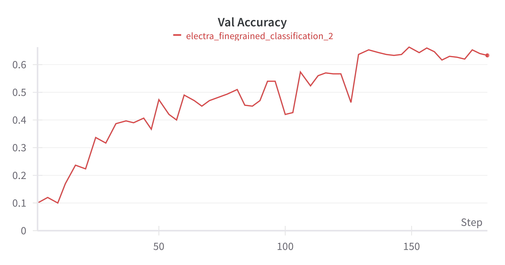

# Logical Fallacy Detection
A repository containing the network to detect and classify logical fallacies in text.

# Model evaluation
## Binary classification

 
 

## Multiclass classification
 
 


* Run docker 
* Modify docker settings to: 
```json 
{
  "builder": {
    "gc": {
      "defaultKeepStorage": "20GB",
      "enabled": true
    }
  },
  "experimental": false,
  "features": {
    "buildkit": false
  }
}
```

* Build and run docker
```bash
chmod +x deploy.sh
./deploy.sh
```


### Repo structure
* `network/models` - Models weights.
* `network/utils` - Models definitions and utils for inference.
* `network/training/data` - Data used for training binary and multiclass classification models.
* `network/training/baseline` - Code for training baseline NLI models.
* `network/training/prototex` - Code for training CBR ProtoTEx model.
